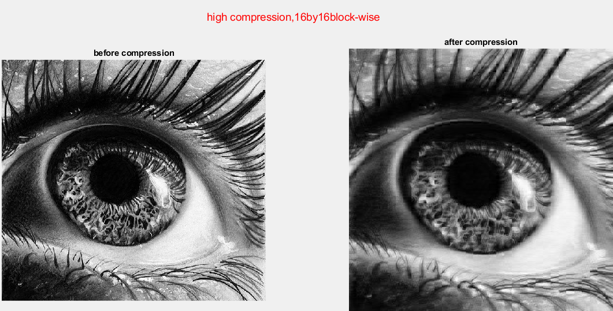

# Image JPEG Compression
*Undergraduate Information Theory Course*  
*Project Partner: [Asmaa Shaban](https://github.com/Asmaa-S)*

This project is an implementation of the DCT-based JPEG image Compression. 
To do the compression, we implemented the DCT algorithm,
quantization, run length encoding/decoding, and 
huffman encoder/decoder from scratch and used them.

### Sample result

